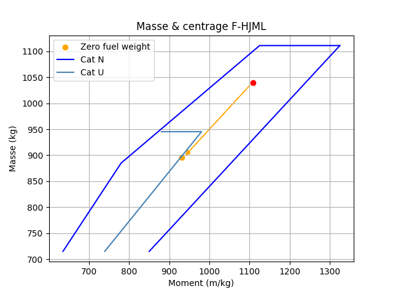

# Masse-Centrage

Deux fichiers python pour faire rapidement les calculs de masse et centrage des deux avions de voyage du cercle aérien Peugeot, F-HJML et F-GOOF

Voici donc deux fichiers python qui permettent de faire les calculs de M&C.  
Pour les utiliser, il suffit d'exécuter les fichiers, dans la console se succèderont des invites pour renseigner les différents paramètres tels que les masses chargées et la quantité d'essence à bord.  
Il apparaitra alors la masse totale au décollage, ainsi que le centrogramme dans lequel on pourra voir l'évolution du centrage au fur et à mesure du vol (consommation du fuel).  

## Voici deux exemples de centrogrammes

 

## Pré-requis

Il vous faut les modules python `matlpotlib` et `numpy`.

Si vous ne les avez pas suivez le tuto suivant.

### Windows

Vérifiez que vous avez bien python :
```python --version```

Puis que vous avez bien `pip`:
```pip --version```

Et si tout est bon :
```pip install matplotlib```
puis
```pip install numpy```

### MacOS

Dans le terminal :
```python -m pip install matplotlib```
puis
```python -m pip install numpy```
